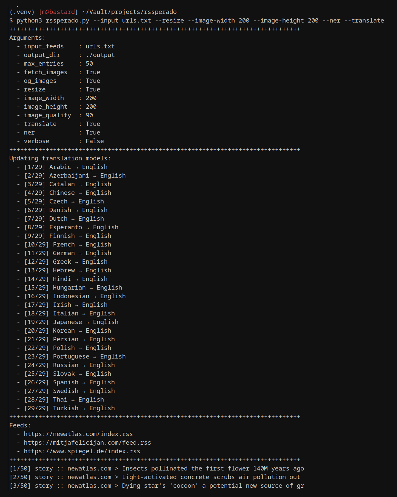

# rssperado


**This project is under active development and still considered work in progress. It is not yet ready for production use. Use at your own risk.**

The RSS parser is a command-line utility that simplifies the process of parsing RSS feeds, enriching the extracted data, exporting it to JSON files, enabling content classification, and providing English translation.

Feeds are parsed in linear order and eacy store is parsed in parallel ensuring the best possible performance. Be sure your machine has enough RAM to handle the load (2 gigs should be enough, but beware of it).

Translations are done with argostranslate that utilizes https://opennmt.net/ for translation. The translation model are downloaded on the first run and cached for future use. The translation model is not included in the repository due to its size.

NER classification is done with https://huggingface.co/transformers/ that utilizes `dbmdz/bert-large-cased-finetuned-conll03-english` model. The model is downloaded on the first run and cached for future use. The model is not included in the repository due to its size. This feature requires translation to be enabled and it always takes the English translation as input.

Extract content goes to the actual page and tries to extract the content from it. It also uses NLP to summarize the full content to a few sentences.

These models can take up a lot of disk space, so be sure to have enough space available (10 gigs on a VM should be enough).

Each feed gets exported as JSON file where the `md5(feed-url)` is the name of the file so it is predictable and easy to integrate into your own code. Example of such a filename would be `26a13287efe864d840c98b840f16465d.json`.

<details>
    <summary>See it in action (click to expand)</summary>
    
</details>

## Features

- Fetchs RSS feeds in parallel
- Fetches images from feed
- Fetches images from OG meta tags as fallback
- Resizes images to specific dimensions
- Translate each story to English
- Enables NER classification
- Detects language of the story
- Allows extraction of content from each story

## Installation

Requirements:
- Python 3.8+
- pip
- virtualenv

```sh
$ [sudo] apt install build-essential python3 python3-venv python3-pip
```

And now the actual installation:

```sh
$ python3 -m venv .venv
$ source .venv/bin/activate
$ pip install -r requirements.txt
```

If you have issues installing PyTorch, please refer to the [official installation guide](https://pytorch.org/get-started/locally/). For CPU only installation, use the following command:

```sh
$ source .venv/bin/activate
$ pip3 install torch torchvision torchaudio --index-url https://download.pytorch.org/whl/cpu
```

## Usage

```sh
$ source .venv/bin/activate
$ python3 rssperado.py --input urls.txt --resize --image-width 200 --image-height 200 --ner --translate
```

### Help command output

```sh
$ source .venv/bin/activate
$ python3 rssperado.py --help

usage: rssperado.py [-h] --input-feeds INPUT_FEEDS [--output-dir OUTPUT_DIR] [--max-entries MAX_ENTRIES]
                    [--fetch-images | --no-fetch-images] [--og-images | --no-og-images] [--resize | --no-resize]
                    [--image-width IMAGE_WIDTH] [--image-height IMAGE_HEIGHT] [--image-quality IMAGE_QUALITY]
                    [--extract-content | --no-extract-content] [--translate | --no-translate] [--ner | --no-ner]
                    [--verbose | --no-verbose] [--version]
```


### Available options

| Option                                  | Description                                     |
| --------------------------------------- | ----------------------------------------------- |
| -h, --help                              | Show this help message and exit                 |
| --input-feeds INPUT_FEEDS               | Specify input file with the list of RSS feeds   |
| --output-dir OUTPUT_DIR                 | Specify output directory (default: ./output)    |
| --max-entries MAX_ENTRIES               | Specify max feed entries to parse (default: 50) |
| --fetch-images, --no-fetch-images       | Fetches images from feed                        |
| --og-images, --no-og-images             | Fetches images from OG meta tags as fallback    |
| --resize, --no-resize                   | Resizes images to specific dimensions           |
| --image-width IMAGE_WIDTH               | Specify resized image width (default: 800)      |
| --image-height IMAGE_HEIGHT             | Specify resized image height (default: 600)     |
| --image-quality IMAGE_QUALITY           | Specify resized image quality (default: 90)     |
| --extract-content, --no-extract-content | Extracts content from each story                |
| --translate, --no-translate             | Translate each story to English                 |
| --ner, --no-ner                         | Enables NER classification                      |
| --verbose, --no-verbose                 | Make the operation more talkative               |
| --version                               | Show program's version number and exit          |


### Example input file

Each line in the input file represents a single RSS feed URL.

```text
https://newatlas.com/index.rss
https://mitjafelicijan.com/feed.rss
https://www.spiegel.de/index.rss
```

### Example output file

```json
[{
  "guid": "efb152d38b66ec229e8d654e0235181b",
  "link": "https://www.spiegel.de/ausland/flugzeugabsturz-bei-washington-d-c-pilot-sass-zusammengesackt-im-cockpit-a-b5f70396-b3f4-48b1-b6ca-f2063fb02ed0",
  "title": {
    "origin": "Flugzeugabsturz bei Washington D.C.: Pilot saß zusammengesackt im Cockpit",
    "en": "Aircraft crash at Washington D.C.: Pilot sat down in cockpit"
  },
  "summary": {
    "origin": "Neue Details im rätselhaften Fall des abgestürzten Kleinflugzeugs nahe der US-Hauptstadt: So war der Pilot der Cessna vor dem Crash offenbar bewusstlos – möglicherweise wegen eines Sauerstoffproblems.",
    "en": "New details in the mysterious case of the crashed small aircraft near the US capital: Thus, the pilot of the Cessna before the crash was apparently unconscious – possibly due to an oxygen problem."
  },
  "published": {
    "ago": "7 hours ago",
    "dt": "Tue, 6 Jun 2023 02:36:08 +0200"
  },
  "ner": [
    {
      "entity_group": "LOC",
      "score": "0.51140416",
      "word": "Hauptstadt",
      "start": 152,
      "end": 162
    }, {
      "entity_group": "ORG",
      "score": "0.7654832",
      "word": "Cessna",
      "start": 185,
      "end": 191
    }
  ],
  "image_filename": "efb152d38b66ec229e8d654e0235181b.jpg",
  "image_url": "https://cdn.prod.www.spiegel.de/images/61ebb31e-d8b6-4c8a-8be0-6150d6a98963_w520_r2.08_fpx49.5_fpy49.98.jpg",
  "podcast_url": null,
  "source": "www.spiegel.de",
  "type": "story",
  "origin_language": "de"
}]
```

## Available translations

- Arabic → English
- Azerbaijani → English
- Catalan → English
- Chinese → English
- Czech → English
- Danish → English
- Dutch → English
- Esperanto → English
- Finnish → English
- French → English
- German → English
- Greek → English
- Hebrew → English
- Hindi → English
- Hungarian → English
- Indonesian → English
- Irish → English
- Italian → English
- Japanese → English
- Korean → English
- Persian → English
- Polish → English
- Portuguese → English
- Russian → English
- Slovak → English
- Spanish → English
- Swedish → English
- Thai → English
- Turkish → English
